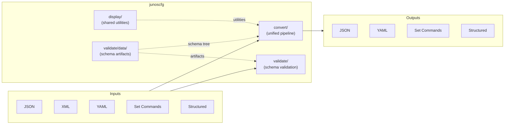
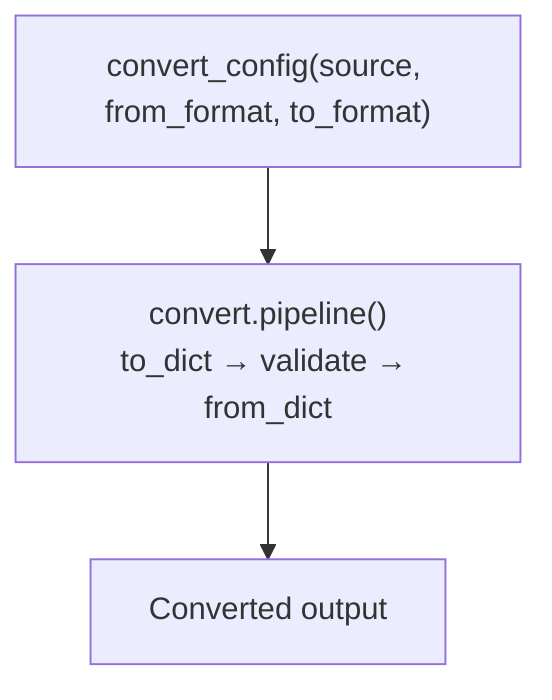
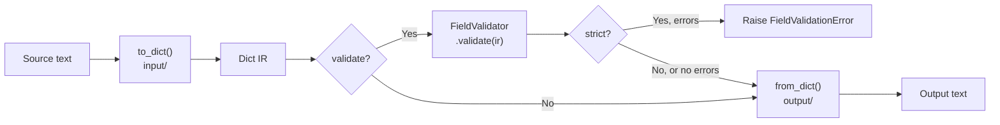
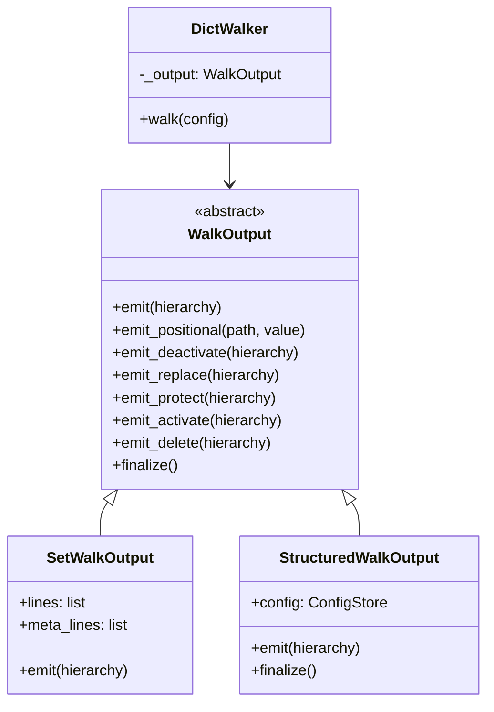
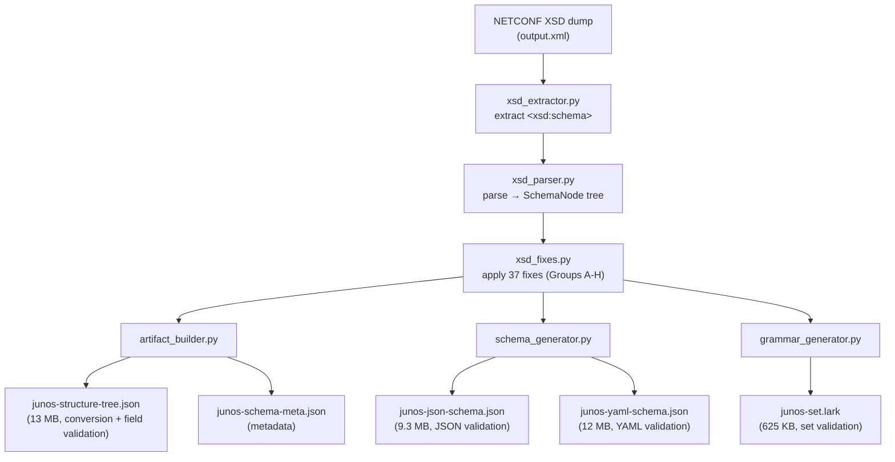
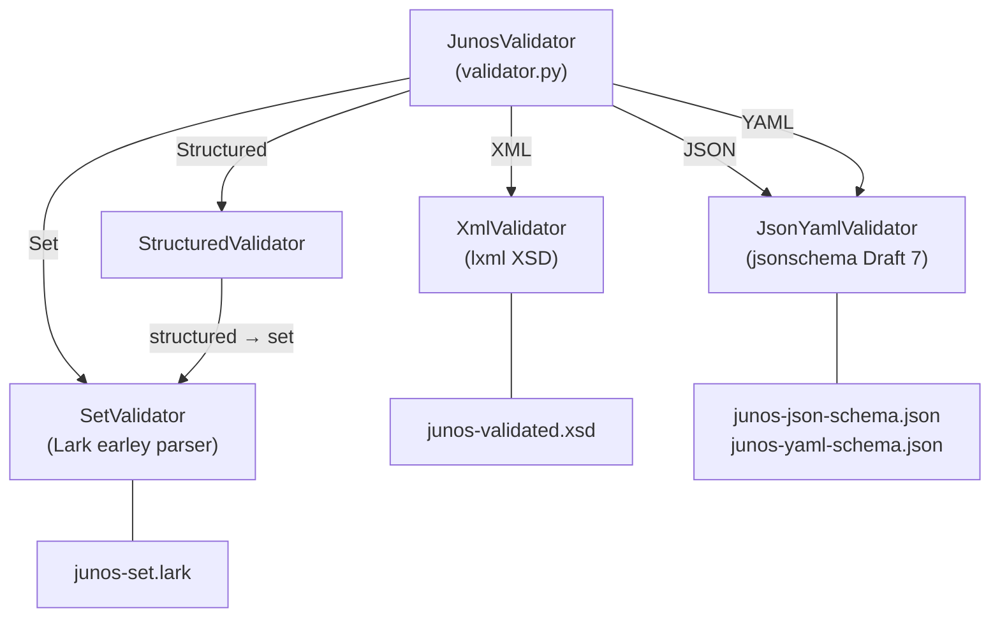
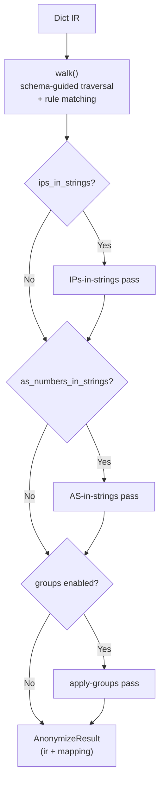

# Developer Guide

A comprehensive architecture reference for developers working on the junoscfg codebase.
This document covers the three major subsystems, data flow, design patterns, and where to
make changes for common tasks.

**Audience:** Contributors, maintainers, and AI coding agents working on this project.

**Companion docs:**

- [Design Decisions](design-decisions.md) — rationale behind key architectural choices
- [Schema Internals](schema-internals.md) — deep dive into the XSD pipeline and artifact format
- [Conversion Bugfix Guide](conversion-bugfix-guide.md) — step-by-step methodology for fixing conversion bugs

---

## Principles

These principles govern all code changes in this project. They are non-negotiable
constraints that must be followed consistently.

**Schema as Single Source of Truth.** The Junos XSD schema is the authoritative source
of structural and type information. When data can be extracted from the XSD — enums,
patterns, types, mandatory flags, element relationships — it must be extracted rather
than hardcoded. When the XSD is wrong or incomplete, fix it at the schema level in
`xsd_fixes.py`, not with runtime workarounds. Schema fixes are Python code that
persists across XSD regeneration; they are applied every time artifacts are rebuilt
from any Junos version's XSD dump.

**Prefer Established, Actively Maintained Libraries.** Use battle-tested, well-maintained
dependencies over custom implementations. The project uses lxml for XML processing (not
stdlib xml), Lark for grammar-based parsing (not hand-written parsers), jsonschema for
JSON/YAML validation (not custom logic), and Click for CLI (not argparse). Do not add new
dependencies for problems solvable with existing ones.

**Graceful Degradation with Explicit Strict Mode.** Default behavior is to warn on
non-critical issues and continue processing. Field validation prints warnings to stderr
but does not fail by default. Strict mode (`--strict` / `strict=True`) is opt-in and
converts warnings to fatal errors. When the schema tree is unavailable for a code path,
converters fall back to hardcoded constants or heuristics. Never fail silently — always
report issues to stderr or through `FieldValidationResult.warnings`.

**Backward Compatibility (after v1.0.0).** Once the project reaches version 1.0.0,
existing public APIs and CLI syntax must remain functional. New APIs are added alongside
old ones (e.g., `convert_config()` alongside `display_set_from_json()`). CLI backward
compatibility uses patterns like `DefaultGroup` to accept both old and new syntax.
Pre-1.0.0 (current state), breaking changes are acceptable with documentation.

**Test After Code Changes.** Every code change should be accompanied by tests that prevent
regressions and verify new behavior. Bug fixes require a test that reproduces the bug before
the fix. New features require tests that verify the feature works. Schema changes require
running the test suite with `--regen-schema` to verify artifacts remain correct. Test
behavior, not implementation details.

!!! note "For AI coding agents"
    If you are an AI agent generating code for this project, treat these five principles
    as hard constraints. In particular: prefer schema-level fixes over runtime workarounds,
    use existing libraries rather than writing custom implementations, and ensure every
    code change includes appropriate tests.

---

## System Overview

Junoscfg has three major subsystems that work together to convert and validate Junos
configurations across five formats: JSON, XML, YAML, display set, and structured
(curly-brace).



| Subsystem | Location | Purpose |
|-----------|----------|---------|
| **convert/** | `src/junoscfg/convert/` | Unified pipeline: any format → dict IR → any format, with field validation |
| **display/** | `src/junoscfg/display/` | Shared utilities: constants, config store, value formatting, set converter, XML→YAML bridge |
| **validate/** | `src/junoscfg/validate/` | Schema validation against XSD, JSON Schema, Lark grammar; artifact generation |

The `__init__.py` at package root provides the unified public API (`convert_config()`,
`validate_json()`, etc.) and routes all conversion pairs through the pipeline.

---

## Conversion Pipeline

All conversions route through the unified `convert/` pipeline. The `convert_config()`
function in `src/junoscfg/__init__.py` dispatches to `convert.pipeline()` for all 20
format pairs.



### Routing logic

`convert_config()` uses `_CONVERTERS` — a dict mapping `(Format, Format)` tuples to
converter function names (20 pairs total, including 4 identity conversions). All
converters go through the pipeline and support `validate`/`strict` kwargs for
field-level validation.

### Dispatch table

| From → To | Pipeline path | Field Validation |
|-----------|--------------|:----------------:|
| JSON → Set | `json` → dict → `set` | Yes |
| JSON → Structured | `json` → dict → `structured` | Yes |
| JSON → YAML | `json` → dict → `yaml` | Yes |
| XML → Set | `xml` → dict → `set` | Yes |
| XML → Structured | `xml` → dict → `structured` | Yes |
| XML → YAML | `xml` → dict → `yaml` | Yes |
| XML → JSON | `xml` → dict → `json` | Yes |
| YAML → Set | `yaml` → dict → `set` | Yes |
| YAML → Structured | `yaml` → dict → `structured` | Yes |
| YAML → JSON | `yaml` → dict → `json` | Yes |
| SET → Structured | `set` → dict → `structured` | Yes |
| SET → JSON | `set` → dict → `json` | Yes |
| SET → YAML | `set` → dict → `yaml` | Yes |
| Structured → Set | `structured` → dict → `set` | Yes |
| Structured → JSON | `structured` → dict → `json` | Yes |
| Structured → YAML | `structured` → dict → `yaml` | Yes |
| JSON → JSON | `json` → dict → `json` | Yes |
| SET → SET | `set` → dict → `set` | Yes |
| YAML → YAML | `yaml` → dict → `yaml` | Yes |
| Structured → Structured | `structured` → dict → `structured` | Yes |

---

## Canonical Pipeline (`convert/`)

The canonical pipeline converts any supported input format to the JSON dict IR,
optionally validates leaf values, and renders the IR to any output format.



### Entry point: `pipeline()`

`src/junoscfg/convert/__init__.py` exposes four public functions:

| Function | Purpose |
|----------|---------|
| `pipeline(source, from_format, to_format, validate, strict)` | Full conversion with optional validation |
| `to_dict(source, fmt)` | Parse any format into the dict IR |
| `from_dict(config, fmt)` | Render the dict IR to any format |
| `validate_ir(config)` | Standalone field validation on a dict IR |

### Input converters (`convert/input/`)

Each input module parses a format into the unwrapped dict IR (the content inside
`{"configuration": ...}`):

| Module | Function | Notes |
|--------|----------|-------|
| `json_input.py` | `json_to_dict()` | Parses JSON, uses `find_configuration()` to unwrap |
| `yaml_input.py` | `yaml_to_dict()` | Parses YAML, uses `find_configuration()` |
| `xml_input.py` | `xml_to_dict()` | XML→YAML bridge via `xml_to_yaml()` + `yaml_to_dict()` |
| `set_input.py` | `set_to_dict()` | Tokenizes set commands, walks schema tree to build dict |
| `structured_input.py` | `structured_to_dict()` | Two-hop: structured → set → dict |

### Output converters (`convert/output/`)

Each output module renders the dict IR to a target format:

| Module | Function | Notes |
|--------|----------|-------|
| `json_output.py` | `dict_to_json()` | Wraps in `{"configuration": ...}`, dumps JSON |
| `yaml_output.py` | `dict_to_yaml()` | Wraps and dumps YAML |
| `set_output.py` | `dict_to_set()` | Uses `DictWalker` + `SetWalkOutput` |
| `structured_output.py` | `dict_to_structured()` | Uses `DictWalker` + `StructuredWalkOutput` |
| `xml_output.py` | `dict_to_xml()` | Not yet implemented |

### Strategy pattern: DictWalker and WalkOutput

The `DictWalker` class (`convert/output/dict_walker.py`) contains the core recursive
algorithm for walking a Junos JSON dict against the schema tree. It delegates all output
decisions to a `WalkOutput` strategy object:



- **`SetWalkOutput`** accumulates `"set ..."`, `"deactivate ..."`, `"protect ..."`, `"activate ..."`, and `"delete ..."` command strings inline (meta commands are interleaved with set commands, not deferred to the end)
- **`StructuredWalkOutput`** pushes hierarchy paths into a `ConfigStore` for curly-brace rendering, deferring attribute operations (`replace:`, `protect:`, `inactive:`) until `finalize()`

---

## Display Utilities (`display/`)

The `display/` package provides shared utility modules used by the `convert/` pipeline:

| Module | Purpose | Consumer |
|--------|---------|----------|
| `constants.py` | Schema flag helpers, XML-compat constants, `KEY_ALIASES` (XML↔set name mapping) | `convert/output/dict_walker.py`, `convert/output/structured_output.py`, `convert/input/set_input.py` |
| `config_store.py` | Ordered tree for building structured output; supports operational prefixes | `convert/output/structured_output.py`, CLI filter |
| `value_format.py` | Value formatting (quoting, escaping) | `convert/output/dict_walker.py`, `convert/output/structured_output.py` |
| `set_converter.py` | Structured → set command parsing | `convert/input/structured_input.py`, `validate/structured_validator.py` |
| `to_yaml.py` | XML→YAML bridge (`xml_to_yaml()`), YAML path filtering | `convert/input/xml_input.py`, CLI |
| `to_json.py` | JSON path filtering (`filter_json_by_path()`) | CLI |
| `xml_helpers.py` | XML element utilities | `to_yaml.py` |
| `__init__.py` | `is_display_set()`, `filter_set_by_path()` | CLI |

---

## Intermediate Representation (IR)

The IR is a plain Python dict matching the Junos JSON configuration format. It is the
internal data structure that flows through the canonical `convert/` pipeline.

### Conventions

The IR dict is **unwrapped** — it contains the content inside `{"configuration": ...}`,
not the envelope itself. The `find_configuration()` function in `convert/ir.py` handles
unwrapping from various envelope formats (bare config, `rpc-reply` wrappers, or already
unwrapped content).

### Convention 1: `@`-prefixed attribute keys

Operational attributes (inactive, replace, protect, delete) are stored as sibling
keys with an `@` prefix:

```json
{
  "system": {
    "host-name": "r1"
  },
  "@system": {
    "inactive": true
  }
}
```

Container-level attributes use `"@"` (bare at-sign) inside the container dict:

```json
{
  "system": {
    "@": { "inactive": true },
    "host-name": "r1"
  }
}
```

### Convention 2: `[None]` presence flags

Presence flags (elements with no value, like `exact` or `longer`) are represented
as `[None]` (a list containing a single `null`):

```json
{
  "route-filter": [
    {
      "address": "0.0.0.0/0",
      "exact": [null]
    }
  ]
}
```

### Convention 3: Named lists

Named lists are arrays of objects where each object has a `"name"` key:

```json
{
  "interfaces": {
    "interface": [
      {
        "name": "ge-0/0/0",
        "unit": [
          {
            "name": "0",
            "family": { "inet": { "address": [{ "name": "10.0.0.1/24" }] } }
          }
        ]
      }
    ]
  }
}
```

### Convention 4: Transparent containers

Some container elements wrap a named list child (an XML artifact). The inner element
name does not appear in set commands:

```json
{
  "interfaces": {
    "interface": [...]
  }
}
```

Here `"interfaces"` is a transparent container whose child `"interface"` is the actual
named list. The set command is `set interfaces ge-0/0/0 ...`, not
`set interfaces interface ge-0/0/0 ...`.

### Convention 5: `find_configuration()` unwrapping

The `find_configuration()` function in `convert/ir.py` locates the configuration dict
from various input formats:

```python
find_configuration({"configuration": {"system": {...}}})    # → {"system": {...}}
find_configuration({"rpc-reply": {"configuration": {...}}}) # → {"system": {...}}
find_configuration({"system": {...}})                       # → {"system": {...}} (bare)
```

---

## Schema Pipeline and Artifacts

The schema pipeline transforms a NETCONF XSD dump into validation and conversion
artifacts at build time. These artifacts are bundled in the package for runtime use.



### Artifacts

| Artifact | Consumer | Purpose |
|----------|----------|---------|
| `junos-structure-tree.json` | `display/constants.py`, `convert/field_validator.py` | Compact schema tree for conversion decisions and field validation |
| `junos-json-schema.json` | `validate/json_yaml_validator.py` | JSON Schema Draft 7 for JSON config validation |
| `junos-yaml-schema.json` | `validate/json_yaml_validator.py` | JSON Schema Draft 7 for YAML config validation |
| `junos-set.lark` | `validate/set_validator.py` | Lark grammar for set command validation |
| `junos-schema-meta.json` | `validate/validator.py` | Version, generation timestamp, schema statistics |

For detailed information about the schema pipeline, the XSD source format, and the
structure tree compact format, see [Schema Internals](schema-internals.md).

---

## XSD Fix Methodology

The `xsd_fixes.py` module applies structural corrections to the SchemaNode tree after
parsing. Fixes are organized into eight groups:

| Group | Category | Description | Count |
|-------|----------|-------------|-------|
| **A** | Variable placeholders | `$junos-*` freeform elements (handled in parser) | — |
| **B** | Structure replacement | Replace `groups` with proper container→named-list pattern | 1 |
| **B2** | Missing flags | Mark elements with missing `oneliner` flag | 1 |
| **C** | Literal symbol names | Rename `equal-literal` → `=`, `plus-literal` → `+`, `minus-literal` → `-` | 3 |
| **D** | Missing elements | Add missing alternatives, arguments, and elements | 13 |
| **E** | Wrong element names | Rename elements whose XSD names differ from CLI names | 5 |
| **F** | Nokeyword/generic names | Mark elements as freeform or positional | 4 |
| **G** | Structure/combinator | Fix element combinators (choice → seq_choice), presence flags | 6 |
| **H** | Conversion hints | Encode runtime behavior into schema flags (transparent, flat-entry, positional-key) | 7 |

### Persistence model

XSD fixes are **Python code**, not data stored in artifacts. They are applied every
time artifacts are regenerated from an XSD dump. This means:

1. Fixes persist across Junos version upgrades (re-running the pipeline on a new XSD)
2. Fixes are registered in the `ALL_FIXES` list and applied via `apply_all_fixes(root)`
3. Each fix is an `XsdFix` dataclass with id, category, description, and apply function

Groups A-G fix genuine XSD deficiencies. Group H encodes conversion-hint flags that
tell the runtime converters how to handle specific elements, replacing hardcoded
constants in `constants.py`.

For the full fix methodology including worked examples, see the
[Conversion Bugfix Guide](conversion-bugfix-guide.md).

---

## Validation System (`validate/`)

The validation subsystem provides schema-level validation for all five configuration
formats through a unified facade.



### JunosValidator facade

`JunosValidator` in `validate/validator.py` is the unified entry point:

```python
validator = JunosValidator(artifacts_dir=None)  # uses bundled artifacts
result = validator.validate_json(json_string)   # → ValidationResult
```

Key design features:

- **Lazy loading** — Each format-specific validator is created on first use
- **Artifact resolution** — Explicit arg → `JUNOSCFG_ARTIFACTS` env var → bundled `data/`
- **Metadata exposure** — `schema_version` and `generated_at` properties

### Validation backends

| Backend | Validates | Library | Artifact |
|---------|-----------|---------|----------|
| `XmlValidator` | XML configs | lxml `XMLSchema` | `junos-validated.xsd` |
| `JsonYamlValidator` | JSON, YAML configs | jsonschema `Draft7Validator` | `junos-json-schema.json`, `junos-yaml-schema.json` |
| `SetValidator` | Set commands | Lark earley parser | `junos-set.lark` |
| `StructuredValidator` | Structured configs | (via SetValidator) | Converts to set first, then validates |

### Field-level validation

Separate from schema validation, `FieldValidator` in `convert/field_validator.py`
validates individual leaf values in the dict IR against schema constraints:

| Check | Schema flag | Source |
|-------|-------------|--------|
| Enum values | `e` (index into `_enums` array) | Schema tree |
| Union type numerics | `e` (with numeric/range fallback) | Schema tree + heuristic |
| Regex patterns | `r` (index into `_patterns` array) | Schema tree |
| IP address format | `tr` (type reference) — dual-stack (`ipaddr`/`ipprefix` accept IPv4 and IPv6) | XSD type names |
| Integer bounds | `tr` (type reference) | XSD type names |
| Boolean values | `tr` (type reference) | XSD type names |
| List elements | (per-element) | Each list element validated individually |
| Mandatory fields | `m` flag (skipped for flat-dict children) | Schema tree |

Field validation runs as part of the `convert/` pipeline (between `to_dict()` and
`from_dict()`). Mandatory field violations produce warnings, not errors.

**Union type handling.** Many Junos fields use XSD union types that combine an enum
with a numeric type (e.g., `destination-port` accepts `ssh` or `179`). Because the
schema artifact only captures the enum portion, the field validator accepts numeric
values and ranges (`[0-9]+(-[0-9]+)?`) as a fallback when the enum check fails.

**KEY_ALIASES resolution.** The `KEY_ALIASES` dict in `constants.py` maps XML/JSON
element names to their set command keywords when they differ (e.g., `ieee-802.3ad` →
`802.3ad`). These aliases are resolved during both dict-to-set output and set input
parsing so that schema lookups succeed regardless of which name variant is used.

---

## Design Patterns

| Pattern | Where | Why |
|---------|-------|-----|
| **Strategy** | `DictWalker` + `WalkOutput` subclasses | Single walking algorithm, multiple output formats (set commands vs structured) |
| **Lazy Loading** | `JunosValidator` validators, `load_schema_tree()` | Expensive resources (13 MB JSON, Lark grammar) loaded only when needed |
| **Schema Caching** | `load_schema_tree()` module-level singleton | Schema tree parsed once, reused across all converter calls in a process |
| **Deferred Attributes** | `StructuredWalkOutput._deferred` | `ConfigStore` nodes must exist before attributes can be applied; operations are queued during walk and applied in `finalize()` |
| **Facade** | `JunosValidator`, `convert_config()` | Simple unified API hides complexity of multiple validators/converters |
| **Fallback Constants** | `constants.py` schema flag helpers | When schema walk loses track of position, name-based constant lookups provide safe fallback behavior |

---

## CLI Architecture

The CLI is built with Click and provides two command groups: `convert` (default) and
`schema`.

```mermaid
flowchart TD
    CLI["junoscfg\n(main, DefaultGroup)"]
    CLI --> CONV_CMD["convert\n-i/--import-format\n-e/--export-format\n--strict, --path, etc."]
    CLI --> SCHEMA_CMD["schema"]
    SCHEMA_CMD --> GEN["generate\nXSD → artifacts"]
    SCHEMA_CMD --> INFO["info\nshow artifact metadata"]

    CONV_CMD --> DETECT{"Auto-detect\ninput format"}
    DETECT -->|starts with '{' or '['| FMT_JSON[json]
    DETECT -->|starts with '<'| FMT_XML[xml]
    DETECT -->|all lines start with set/deactivate/delete| FMT_SET[set]
    DETECT -->|otherwise| FMT_STRUCT[structured]
```

### DefaultGroup

The `DefaultGroup` class extends `click.Group` to provide backward compatibility.
If the first CLI argument is not a known subcommand, `convert` is prepended
automatically:

```
junoscfg -i json -e set config.json
```

is equivalent to:

```
junoscfg convert -i json -e set config.json
```

### Path filtering

Path filtering (`--path`) is applied **after** conversion. Each output format has
its own filter implementation:

- **set** — `filter_set_by_path()` in `display/__init__.py`
- **structured** — `filter_structured_by_path()` in `display/config_store.py`
- **yaml** — `filter_yaml_by_path()` in `display/to_yaml.py`
- **json/xml** — not supported

---

## Anonymization Pipeline (`anonymize/`)

The anonymization subsystem replaces sensitive data in the dict IR with deterministic
pseudonyms. It operates as a post-processing step in the conversion pipeline, after
`to_dict()` and before `from_dict()`.



### Module reference

| Module | Purpose |
|--------|---------|
| `anonymize/__init__.py` | Public API: `anonymize()` entry point, multi-pass orchestration |
| `anonymize/config.py` | `AnonymizeConfig` dataclass, YAML loader, CLI builder |
| `anonymize/walker.py` | Schema-guided tree walker (parallel schema + IR traversal) |
| `anonymize/path_filter.py` | Include/exclude path matching with glob support |
| `anonymize/revert.py` | Revert dictionary: export, import, apply |
| `anonymize/rules/` | Rule base class, registry (`build_rules()`), and per-category implementations |

### Rules

Rules are checked in priority order; the first matching rule wins:

| Rule | Priority | Category | Match criterion |
|------|----------|----------|----------------|
| Password | 10 | passwords | Schema type reference (secret/encrypted-password) |
| IP | 20 | ips | Schema type reference (ipaddr/ipprefix/ipv6addr) |
| Community | 30 | communities | Schema path under `snmp.community` |
| SSH Key | 40 | ssh_keys | Schema path under `ssh-rsa`/`ssh-dsa`/`ssh-ecdsa`/`ssh-ed25519` |
| Identity | 50 | identities | Schema path for user/full-name/login fields |
| Group | 60 | groups | Schema path for group/view name fields |
| Description | 70 | descriptions | Schema path for `description` leaf |
| AS Number | 80 | as_numbers | Numeric value matching user-provided AS list |
| Sensitive Word | 90 | sensitive_words/patterns | Literal or regex match against user-provided strings |

### Multi-pass architecture

The primary `walk()` pass handles leaves reachable through the schema tree. Three
supplementary passes handle cases the schema walker cannot reach:

1. **IPs-in-strings** — Replaces IP addresses embedded in larger string values
   (e.g., `"server.example.com,10.1.2.3"`) using the IP rule's replacement map
2. **AS-in-strings** — Replaces AS numbers embedded in string values (e.g.,
   `"inet-Upstream-AS64497"`) using the AS rule's replacement map
3. **apply-groups** — Anonymizes group names in `apply-groups` / `apply-groups-except`
   arrays, which have empty schema nodes

---

## Testing Architecture

Tests are organized into three tiers with increasing cost:

| Tier | Command | Duration | Purpose |
|------|---------|----------|---------|
| **Fast** | `uv run pytest tests/ -q -k 'not ExampleValidation and not ExampleRoundtrip'` | ~0.5s | Unit tests, conversion tests, structural tests |
| **Regen** | Add `--regen-schema` to fast tests | ~90s | Regenerates schema artifacts from XSD, verifies pipeline integrity |
| **Full** | `uv run pytest tests/ -q --regen-schema` | ~90s+ | Includes slow example validation and roundtrip tests |

### When to use each tier

- **During development** — Run fast tests (no `--regen-schema`)
- **Before committing** — Run with `--regen-schema` to ensure schema artifacts are current
- **After XSD/schema changes** — Always use `--regen-schema` to regenerate `junos-structure-tree.json`

For the full list of development commands, see the project CLAUDE.md.

---

## Extension Guide

### Adding a new input format

1. Create `src/junoscfg/convert/input/<format>_input.py` with a `<format>_to_dict(source)` function
2. Add a dispatch branch in `src/junoscfg/convert/input/__init__.py`
3. The function must return the unwrapped config dict (no `{"configuration": ...}` envelope)
4. Add the format to `Format` enum in `src/junoscfg/__init__.py`

### Adding a new output format

1. Create `src/junoscfg/convert/output/<format>_output.py` with a `dict_to_<format>(config)` function
2. Add a dispatch branch in `src/junoscfg/convert/output/__init__.py`
3. For dict-walking outputs, create a `WalkOutput` subclass and use `DictWalker`
4. Add the format to `Format` enum in `src/junoscfg/__init__.py`

### Fixing a conversion bug

Follow the methodology in the [Conversion Bugfix Guide](conversion-bugfix-guide.md):

1. Reproduce and diff against expected output
2. Classify root cause (schema flag, schema structure, or runtime constant)
3. Apply fix in `xsd_fixes.py` (preferred) or `constants.py` (XML-compat only)
4. Regenerate artifacts with `--regen-schema`
5. Add regression test

### Adding a new schema flag

1. Add the flag to `SchemaNode.flags` in `xsd_fixes.py` during fix application
2. Serialize the flag in `artifact_builder.py` (add to `_serialize_node()`)
3. Add a helper function in `constants.py` to read the flag from schema nodes
4. Consume the flag in the appropriate converter(s)
5. Add XML-compat fallback constant if needed for `xml_to_set.py`

### Adding a new validation backend

1. Create `src/junoscfg/validate/<format>_validator.py` implementing a `validate(source)` method
2. Add a lazy-loaded property in `JunosValidator`
3. Add a `validate_<format>()` method to the facade
4. If the backend needs a new artifact, add generation to `artifact_builder.py`

---

## Decision Log

For rationale behind key architectural choices (schema-driven vs trie, dependency
selection, value quoting, etc.), see [Design Decisions](design-decisions.md).
